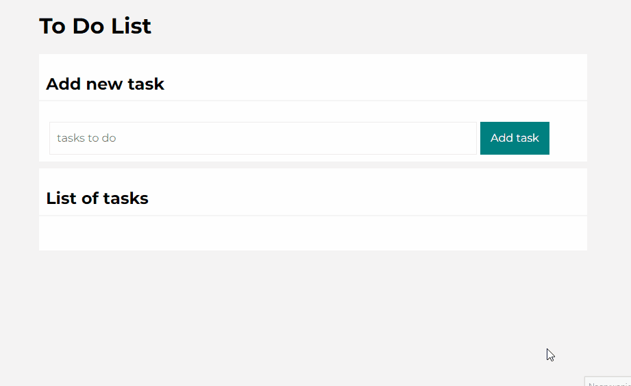

# To Do List

# Demo
<<<<<<< HEAD
[See To Do List](https://github.com/KarolinaJ33/To-Do-List/)
=======
[See To Do List]( https://karolinaj33.github.io/To-Do-List/)
>>>>>>> 4aa3bf0643f4c22264009a8973b52de216b08ef6

# Description
I have created a simply to do list. You can add tasks, mark as completed and remove from the list.
# Technologies used
- HTML
- Normalize
- CSS
- JavaScript
- ES6+ features
- Flexbox
- BEM convention
- GIT
- Media queries
